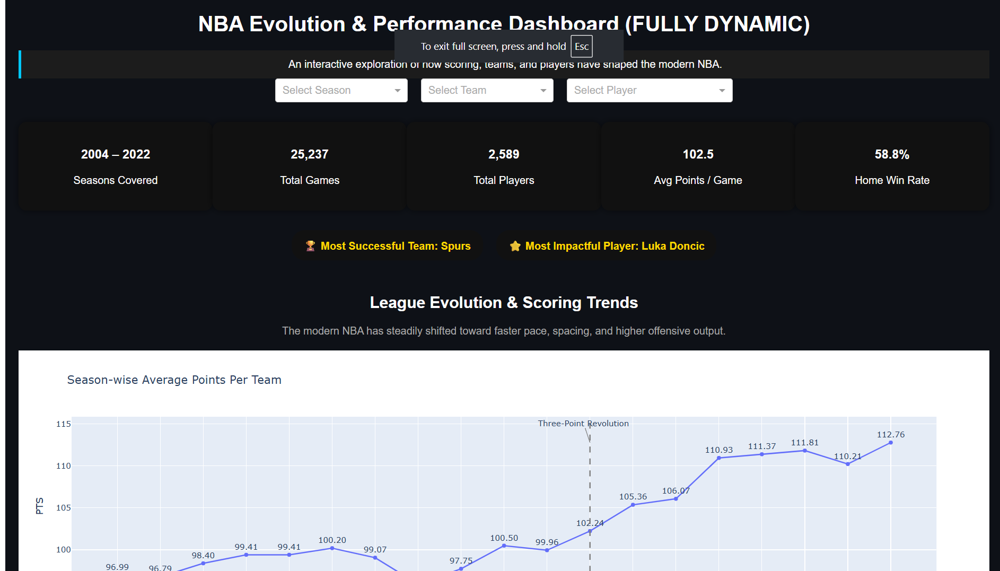
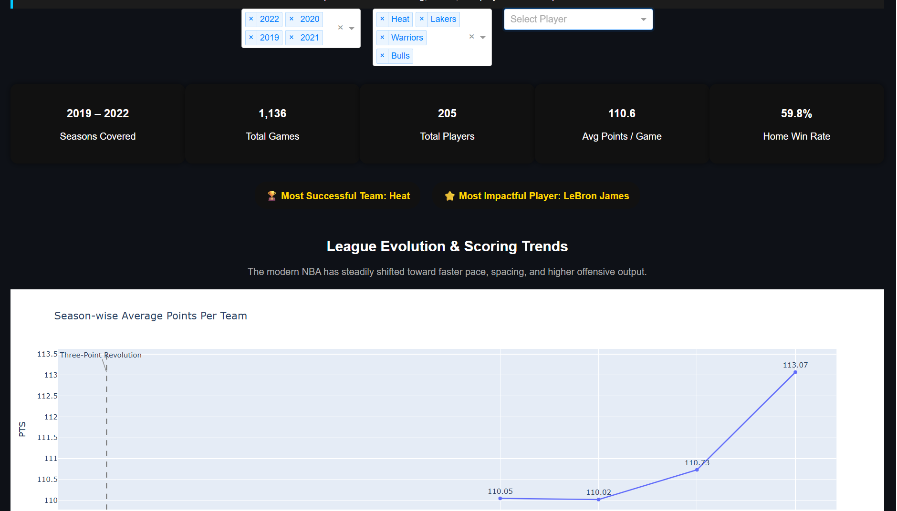
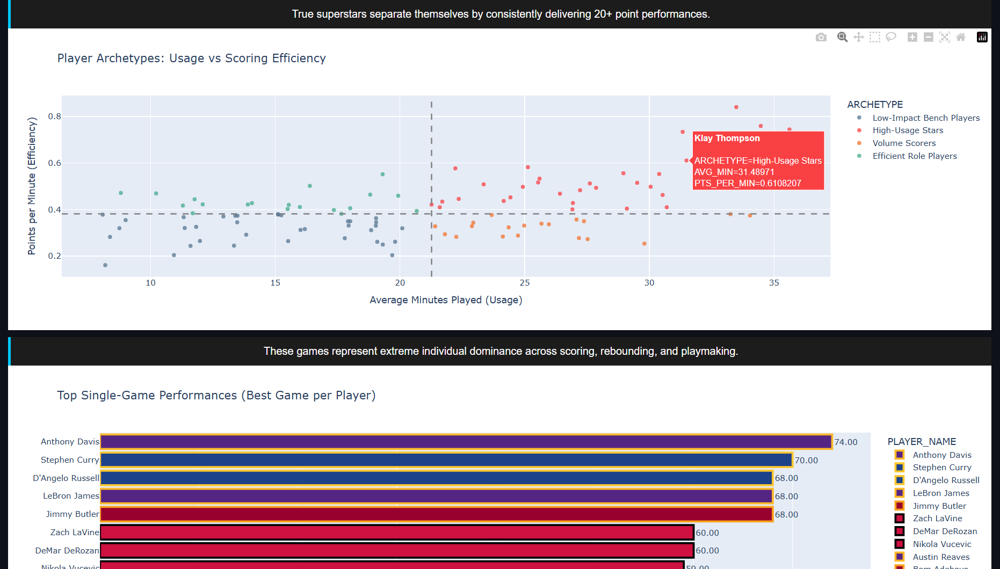
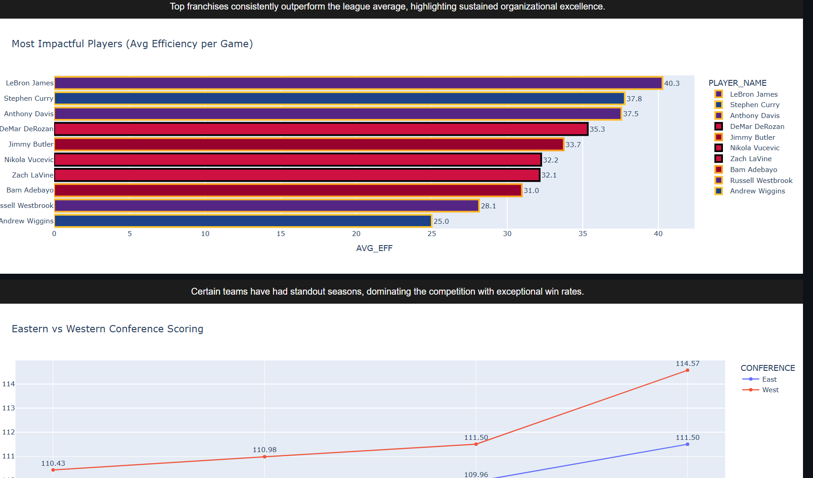
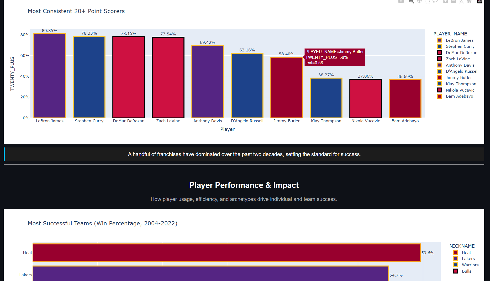

# Statistella — NBA Evolution Dashboard


An interactive Python dashboard (Plotly Dash) for exploring NBA team and player evolution (2004–2022). It includes dynamic KPIs, insight callouts, two-tone team coloring, and interactive filters.

## Table of Contents

- [Overview](#overview)
- [Quick Start](#quick-start)
- [Project Structure](#project-structure)
- [Features](#features)
- [How It Works](#how-it-works)
- [Customization](#customization)
- [Empty States & Troubleshooting](#empty-states--troubleshooting)
- [Screenshots](#screenshots)
- [Next Steps & Contributing](#next-steps--contributing)

---

## Overview

`Statistella` is a Plotly Dash dashboard that visualizes NBA team- and player-level trends from 2004 to 2022. It focuses on clear storytelling, interactive exploration (season/team/player filters), and consistent visual styling using team color pairs.



## Quick Start

### 1. Install dependencies:

```powershell
pip install -r requirements.txt
```

### 2. Run the dashboard:

Here are the steps formatted consistently using PowerShell code blocks:

2.1: Clone the repository

```powershell
git clone https://github.com/5umitpandey/IIT_BHU_Statistella.git
```

2.2: Enter the directory

```powershell
cd IIT_BHU_Statistella/
```

2.3: Install requirements (if a requirements file exists in the root)

```powershell
pip install -r ../requirements.txt
```

2.4: Run the dashboard

```powershell
cd IIT_BHU_Statistella/Code
```

```powershell
python dashboard.py
```


### 3. Open the local URL printed in the terminal (usually `http://127.0.0.1:8050/`).

## Project Structure

- `Code/dashboard.py` — main Dash app and callbacks
- `Processed_Data/` — CSVs consumed by the app (`team_game_stats.csv`, `player_game_stats.csv`)
- `images/` — screenshots used in this README
- `requirements.txt` — Python dependencies

## Features

- Dynamic KPI cards and badges that update with filters
- Multiple interactive charts (season trends, team vs league, conference comparisons, player archetypes)
- Two-tone team coloring: primary fill + secondary outline
- Insight callouts and section headers for storytelling
- Empty-state handling with friendly messages when filtered results are empty





## How It Works

- The layout includes containers such as `kpi_container` and `badges_container` populated by the main callback `update_dashboard`.
- The main callback builds filtered DataFrames and returns KPI children, badge children, and figures for `dcc.Graph` outputs in the same order as the callback outputs.
- Two-tone styling uses a `TEAM_COLORS` dictionary in `dashboard.py` and helpers like `apply_two_tone(fig, primary_map, secondary_map)` to apply fills and outlines.



## Customization

- Change team colors by updating `TEAM_COLORS` in `dashboard.py` (format: `"Team": ("primary_hex", "secondary_hex")`).
- Adjust `insight_box()` and `section_header()` helpers to change layout or styling.
- Add charts or callbacks by following the existing callback pattern and returning figures in the correct order.



## Empty States & Troubleshooting

- If a chart is blank after filtering, check the small message below the chart (e.g. `team_consistency_msg`).
- If Dash shows a callback error, inspect the terminal running the app for a Python traceback.
- Common issues: mismatched CSV column names (e.g. `NICKNAME`, `PTS`) or team name mismatches affecting `TEAM_COLORS` keys.


## Next Steps & Contributing

- Ideas: add per-game rolling averages, a color legend panel, or team name normalization for color aliases.
- To contribute: run the dashboard locally, ensure callbacks return outputs in the correct order, and open a PR describing the change.

---

<div align="center">

## 👥 Team ASHSUM
**Team Members**:

<table>
  <tr>
    <td align="center">
      <br/>
      <a href="https://github.com/ashir1s">Ashiwad Sinha</a>
    </td>
    <td align="center">
      <br/>
      <a href="https://github.com/5umitpandey">Sumit Pandey</a>
    </td>
  </tr>
</table>

</div>

